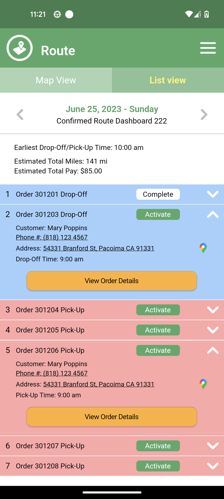

##Driver App With Flutter Clean Architecture
A UI-only driver app with google map, custom camera, horizontal list view calendar, form builder,...
### Main Feature
* `Calendar` - Show work by day
* `Router` - Routes that user will follow by day, check by google maps - position, and can capture the result
* `Profile`
* `Notification`
### Project structure
* `/app` - main application
* `/data` - get data from remote (API) or local (database / local storage) and send to UI layer
* `/domain` - all POJO class, include models app, core of repository
* `/presenter` - code all screens using BLoC state management
* `/env` - config environment
* `/route` - handle all navigator, using route
* `/I10n` - config language in app
* `/utils` - utilities for app
    * `define` - Define some const resource, include images, colors,...
    * `extension` - extension for app
    * `widgets` - common widgets
### Components:
* [BLoC](https://pub.dev/packages/bloc)
* [FlutterFire](https://firebase.flutter.dev/)
* Clean Architecture
* [Google Map](https://pub.dev/packages/google_maps_flutter)
* [Camera](https://pub.dev/packages/camera)
### Usage
* Install Flutter 3.3 
* Run `flutter pub get` to get and sync all library
* Run `flutter pub run intl_utils:generate` to generate files language 
* Run `flutter pub run build_runner build --delete-conflicting-outputs` to generate all models flow json
* Run on device `flutter run`
* Build apk `flutter build apk`
* Build ios `flutter build ios`
### Screenshots
##### Main

##### Calendar

##### Router

##### Finish order

### License
[MIT](https://choosealicense.com/licenses/mit/)